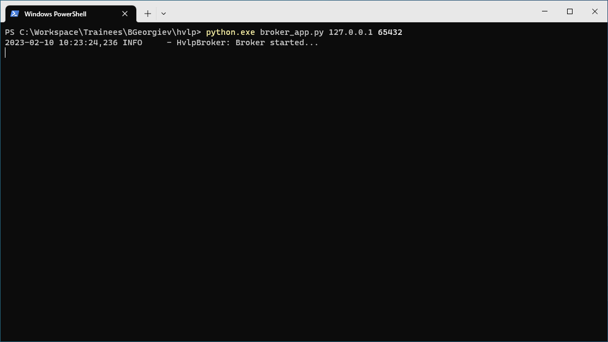
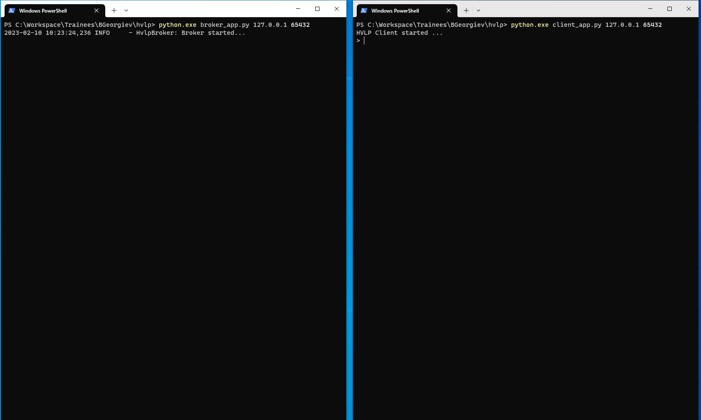
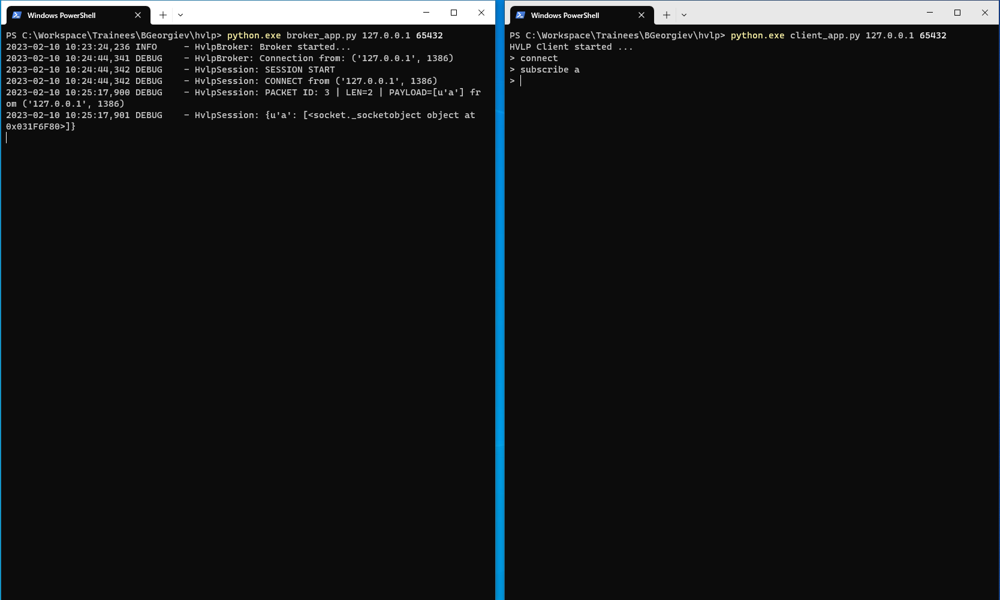
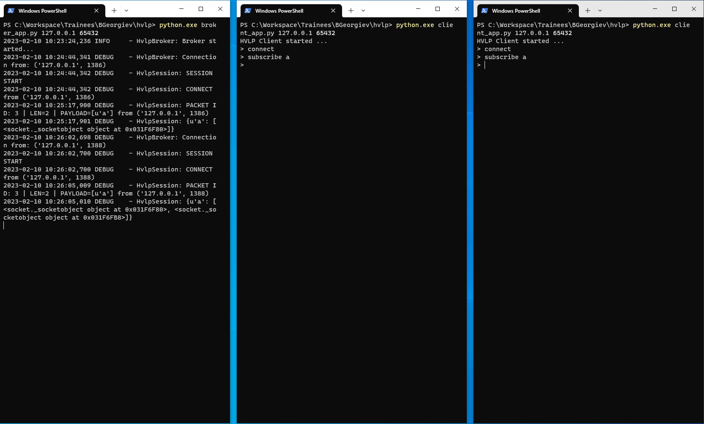
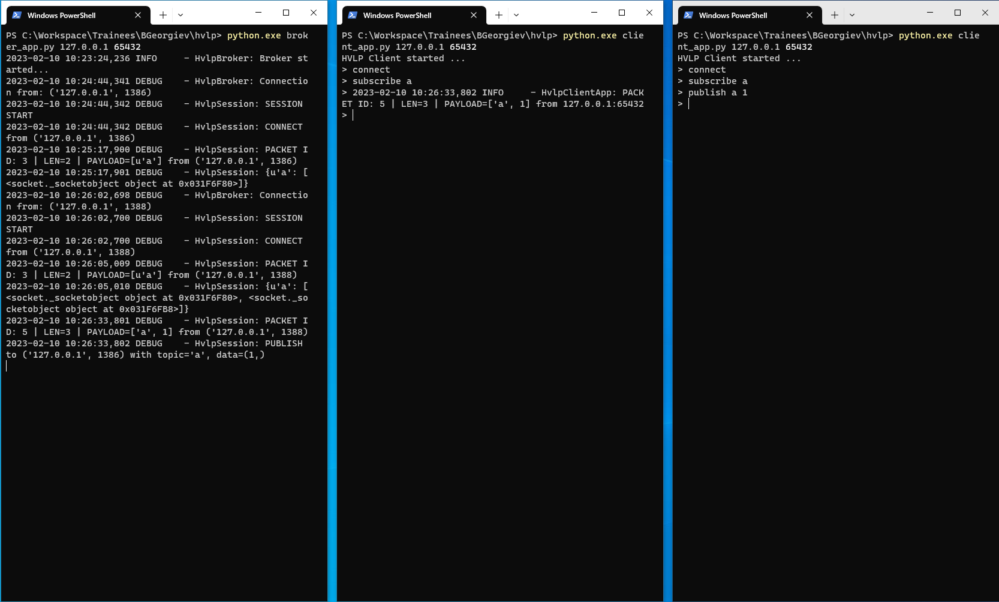
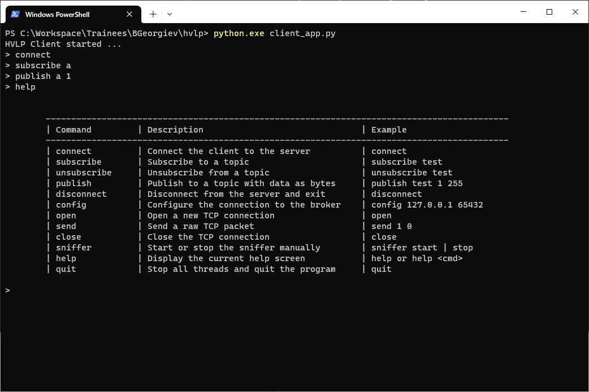

# HVLP - Hilscher Variable Length Protocol

HVLP is a simple protocol for sending messages between clients and a broker. The protocol is 
based on the MQTT protocol and is implemented in Python. The main focus of the project is to
demonstrate the use of OOP, SOLID principles, sockets and threading in Python. 

## Project Setup

### 1. Clone the HVLP project

Use a git client to clone the project from https://github.com/braboj/hvlp to
a folder of your choice.

### 2. Go to the project folder

Type `cd <path to project folder>`

### 3. Open a new command terminal for the broker

Type `set PYTHONPATH=.` to add the root folder to the module search paths.

Type `python broker.py <IP ADDR> <PORT>` to start the broker. If omitted the default IP is 127.0.0.1 and the default port is 65432.

### 4. Open a new command terminal for a client

Type `set PYTHONPATH=.` to add the root folder to the module search paths.

Type `python client.py <SERVER ADDR> <PORT>` to start the client. If omitted the default server 
address is 127.0.0.1 and the default port s 65432.

### 5. Connect the client to the broker

Type `connect` in the client console to connect to the broker

### 6. Subscribe the client to a topic

Type `subscribe test` in the client console to subscribe to a topic

### 7. Repeat steps 4-6 to add a second client

### 8. Publish to a topic

Type publish test 1 in one of the client consoles.

### 9. Get help how to use the application

Type `help` in the client console for more commands

### 10. Exit the applications

Type `quit` or press CTRL + C in a client console to exit the client. To exit the broker press 
CTRL + C. There might be a slight delay (1-2 seconds) until the application ends.

 

