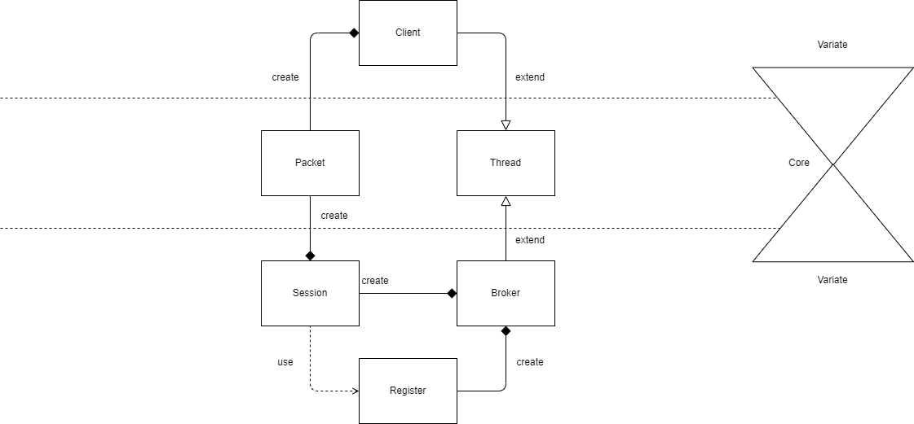

## Class Diagram



## Basic Workflow

1. The Broker, Client and Sessions are Threads
2. The Broker creates and starts a new session on a new connection
3. The new session is registered in the broker register
4. The Session waits for packets from the client and performs actions based on them
5. The Session uses the register from the broker for subscribe, unsubscribe and publish
6. Both the Session and the client create packet objects 

## Client API
The client is a custom thread. The function of the client is to send packets to the broker and 
to handle incoming publish packets forwarded by the broker.

```python
from hvlp.broker import *
from hvlp.client import *
from hvlp.packets import *
from hvlp.errors import *

import threading
import time


###################################################################################################

def producer():
    test_client = HvlpClient()
    test_client.open()
    test_client.connect()
    test_client.subscribe('a')

    for k in range(256):
        test_client.publish('a', k)
        logging.info('PUBLISH')


###################################################################################################

def consumer(stop):
    test_client = HvlpClient()

    test_client.open()
    test_client.connect()
    test_client.subscribe('a')

    t = threading.Thread(target=test_client.listen, args=(stop,))
    t.start()

    while not stop.is_set():
        try:
            packet = Packet.from_bytes(test_client.stream_in)
            test_client.stream_in = test_client.stream_in[len(packet):]
            logging.info(packet)
        except HvlpParsingError:
            pass


###################################################################################################

logging.basicConfig(format='%(asctime)s - %(funcName)-25s: %(message)s', level=logging.INFO)

broker = HvlpBroker()
broker.start()

stop_flag = threading.Event()
stop_flag.clear()

p = threading.Thread(target=producer)
p.start()

c = threading.Thread(target=consumer, args=[stop_flag, ])
c.start()

for i in range(10):
    logging.info('.')
    time.sleep(1)

stop_flag.set()
broker.stop()

```

## Broker API
The broker is a custom thread, which spawns session threads on incoming TCP connections. The broker
is protocol agnostic and only offers tools for topic and client registration.

```python
from hvlp.broker import *
import logging
import socket

logging.basicConfig(format='%(asctime)s - %(funcName)-25s: %(message)s', level=logging.INFO)

# Spawn several brokers as threads
brokers = []
for i in range(10):
    broker = HvlpBroker(port=65000 + i)
    broker.start()
    brokers.append(broker)

# Attempt connection to the broker instances
for broker in brokers:
    sock = socket.socket()
    sock.connect((broker.ip_addr, broker.port))
    sock.close()

# Stop all broker instances
for broker in brokers:
    broker.stop()

```

## Session API
The session is a thread that works with a specific protocol version and handles the incoming 
packets from the client. The session is also responsible to forward incoming publish packets to all
the subscribers of the topic in the publish packet. 


```python
# encoding: utf-8
from __future__ import print_function
from __future__ import absolute_import
from __future__ import unicode_literals

from hvlp.broker import *
from hvlp.client import *
import time


def test_connect():

    broker = HvlpBroker(port=65000)
    broker.start()
    register = broker.register

    # Perform the TCP handshake
    client = HvlpClient(port=65000)
    client.open()
    time.sleep(1)

    # Get the last registered session
    session = register.get_sessions()[-1]

    # Check the session state after the TCP handshake
    assert (session.state == HvlpSession.WAIT_CONNECT and session.is_alive())
    print(session.state)

    # Send the CONNECT packet to the broker
    client.connect()
    time.sleep(1)

    # Check the session state after the CONNECT packet
    assert (session.state == HvlpSession.CONNECTED and session.is_alive())
    print(session.CONNECTED)

    broker.stop()
    broker.join()
```


## Register API
The register class is a helper class used to store information about topics and clients 
subscribed to these topics. As the register object is shared among all sessions, the read and write
operations should be protected.

```python

import logging

###################################################################################################

def test_notify(register):

    test_session = 'test session'

    register.notify(new_session=test_session)
    logging.info("Notify the register with session name `{0}`".format(test_session))

    sessions = register.get_sessions()
    logging.info("The register has the following sessions: {0}".format(sessions))

    assert(test_session in sessions)


###################################################################################################

def test_append(register):

    topics = ['test1', 'test2']
    client = 'test_client'

    register.append(topics, client)
    subscriptions = register.get_topics(client)

    logging.info("The client `{0}` is now subscribed to {1}".format(client, subscriptions))
    assert(subscriptions == topics)


###################################################################################################

def test_remove(register):

    topics = ['test1', 'test2', 'test3']
    client = 'test_client'

    register.append(topics, client)
    register.remove(topics, client)
    subscriptions = register.get_topics(client)

    logging.info("The client `{0}` is now subscribed to {1}".format(client, subscriptions))
    assert (subscriptions == [])


###################################################################################################

def test_reset(register):

    test_notify(register)
    test_append(register)

    register.reset()
    logging.info("After reset the register is {0}".format(register))

    assert (register == {} and register.get_sessions() == [])


###################################################################################################

def test_get_subscribers(register):

    topics = ['test1', 'test2']
    client = 'test_client'

    register.append(topics, client)

    for topic in topics:
        subscribers = register.get_subscribers(topic)
        logging.info("The topic `{0}` has the the subscribers {1}".format(topic, subscribers))
        assert (client in subscribers)


###################################################################################################

def test_get_topics(register):

    topics = ['test1', 'test2']
    client = 'test_client'

    register.append(topics, client)
    subscriptions = register.get_topics(client)
    logging.info("The client  `{0}` is subscribed to {1}".format(client, subscriptions))
    assert (subscriptions == topics)


###################################################################################################

def test_get_sessions(register):

    test_session = 'test session'

    logging.info("Notify the register with session name `{0}`".format(test_session))
    register.notify(new_session=test_session)

    sessions = register.get_sessions()
    logging.info("The register has the following sessions: {0}".format(sessions))

    assert(test_session in sessions)
```


## Packet API
The packet class is the parent of all protocol packets and offers method for serialization and 
deserialization. The serialization is the process of transforming an object into bytes, which 
then can be sent over the connection. The deserialization is the opposite process that reads and 
transforms the bytes into an instance of the packet class.

```python

from hvlp.packets import *

###################################################################################################

def test_packet(payload=(1, 2, 3, 4, 5)):

    packet = Packet(packet_id=7, payload=payload)
    print("@PACKET")
    print("PAYLOAD = {0}".format(payload))

    # Serialize packet
    serialized = tuple(packet.to_bytes())
    print("SERIALIZED = {0}".format(serialized))

    # Deserialize packet
    deserialized = Packet.from_bytes(serialized)
    print("DESERIALIZED = {0}".format(deserialized))

    assert(packet == deserialized)


###################################################################################################

def test_connect(payload=(1, 2, 3, 4, 5)):

    packet = ConnectPacket(payload)
    print("@CONNECT")
    print("PAYLOAD = {0}".format(payload))

    # Serialize packet
    serialized = tuple(packet.to_bytes())
    print("SERIALIZED = {0}".format(serialized))

    # Deserialize packet
    deserialized = Packet.from_bytes(serialized)
    print("DESERIALIZED = {0}".format(deserialized))

    assert(packet == deserialized)


###################################################################################################

def test_disconnect(payload=(1, 2, 3, 4, 5)):

    packet = DisconnectPacket(payload)
    print("@DISCONNECT")
    print("PAYLOAD = {0}".format(payload))

    # Serialize packet
    serialized = tuple(packet.to_bytes())
    print("SERIALIZED = {0}".format(serialized))

    # Deserialize packet
    deserialized = Packet.from_bytes(serialized)
    print("DESERIALIZED = {0}".format(deserialized))

    assert(packet == deserialized)


###################################################################################################

def test_subscribe(topics=('welcome', 'home')):

    packet = SubscribePacket(topics)
    print("@SUBSCRIBE")
    print("TOPICS = {0}".format(topics))

    # Serialize packet
    serialized = tuple(packet.to_bytes())
    print("SERIALIZED = {0}".format(serialized))

    # Deserialize packet
    deserialized = Packet.from_bytes(serialized)
    print("DESERIALIZED = {0}".format(deserialized))

    assert(packet == deserialized)


###################################################################################################

def test_unsubscribe(topics=('welcome', 'home')):

    packet = UnsubscribePacket(topics)
    print("@UNSUBSCRIBE")
    print("TOPICS = {0}".format(topics))

    # Serialize packet
    serialized = tuple(packet.to_bytes())
    print("SERIALIZED = {0}".format(serialized))

    # Deserialize packet
    deserialized = Packet.from_bytes(serialized)
    print("DESERIALIZED = {0}".format(deserialized))

    assert(packet == deserialized)


###################################################################################################

def test_publish(topic='welcome', data=(0xAA, 0x55)):

    packet = PublishPacket(topic, data)
    print("@PUBLISH")
    print("TOPIC = '{0}' DATA = {1}".format(topic, data))

    # Serialize packet
    serialized = tuple(packet.to_bytes())
    print("SERIALIZED = {0}".format(serialized))

    # Deserialize packet
    deserialized = Packet.from_bytes(serialized)
    print("DESERIALIZED = {0}".format(deserialized))

    assert(packet == deserialized)
```


 

